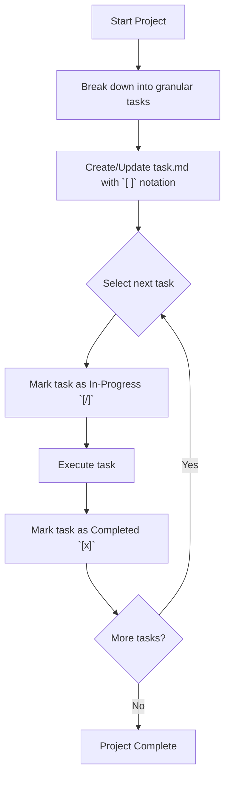

# Agent Task Checklist Management

**MANDATORY DIRECTIVE: You MUST maintain a `task.md` file for all complex projects.**

## Core Rules (Strict Enforcement)
1. **Granularity**: Break down complex projects into atomic, actionable steps.
2. **Notation**: Use exact markdown notation for task states:
   - `[ ]` : Uncompleted
   - `[/]` : In-Progress
   - `[x]` : Completed
3. **Transparency**: Frequent, incremental updates to `task.md` are **NON-NEGOTIABLE**. Reflect state changes immediately upon starting or finishing a step.

## Lifecycle Architecture

